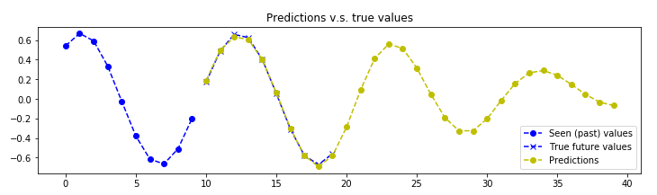

# Signal-Prediction-RNN
Predict signal with RNN 

### Tutorial Overview

Signal prediction has been heavily studied in multiple disciplines and exercised in many forms. Given some prior historic data, prediction allows us to determine the future and make better decisions. Current prediction approaches includes regression (discrete, linear, non-linear), time series models (ARIMA, Hidden Markov) and machine learning models  (neural network, SVM, K-NN). One machine learning approach that grew in popularity amongst practitioners and researchers due to the demand of predictive analytics and evolution of graphic processing units (GPU) , is Recurrent Neural Network. 

In this tutorial, you will learn: 

1. What is Recurrent Neural Network ? 
2. How RNN infer and learn from data samples ?
3. How to define the RNN architecture for your application ?
4. How to implement an RNN for signal prediction in Keras ?

